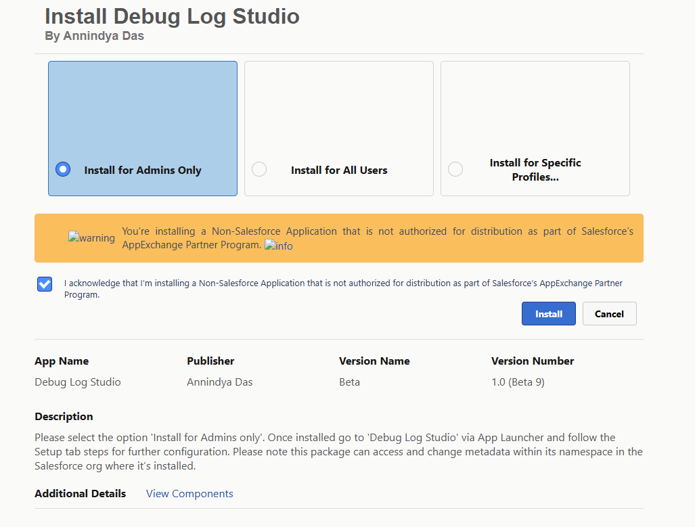
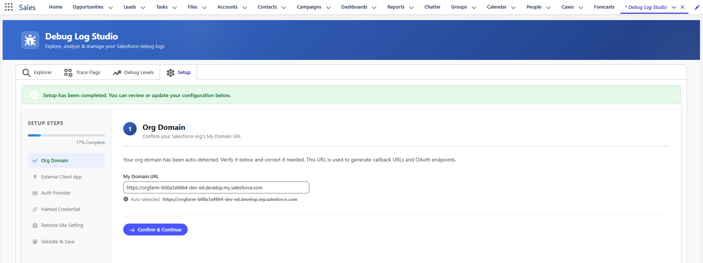
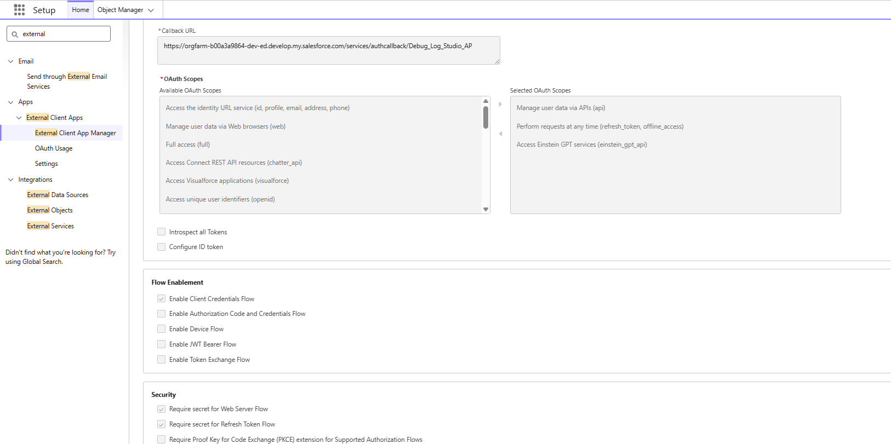
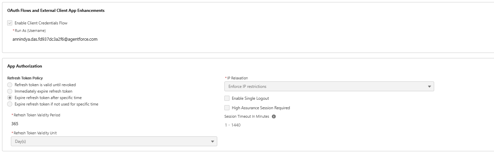

# Debug Log Studio — User Guide

> **Author:** Annindya Das | **Version:** 2026  
> **Prerequisite:** Complete the [Post-Install Setup](#2-setup) steps below before using the Explorer, Trace Flags, or Debug Levels tabs.

---

## Table of Contents

1. [Package Installation](#1-package-installation)
2. [Setup](#2-setup)
   - [Step 1 — Org Domain](#step-1--org-domain)
   - [Step 2 — Create External Client App](#step-2--create-external-client-app)
   - [Step 3 — Create Auth Provider](#step-3--create-auth-provider)
   - [Step 4 — Create Named Credential (Legacy)](#step-4--create-named-credential-legacy)
   - [Step 5 — Create Remote Site Setting](#step-5--create-remote-site-setting)
   - [Step 6 — Validate & Save](#step-6--validate--save)
3. [Operating Debug Log Studio](#3-operating-debug-log-studio)
   - [Debug Levels Tab](#debug-levels-tab)
   - [Trace Flags Tab](#trace-flags-tab)
   - [Explorer Tab](#explorer-tab)
   - [Log Viewer & AI Summary](#log-viewer--ai-summary)
4. [Need Help?](#4-need-help)

---

## 1. Package Installation

> **Requirement:** The org must have **Agentforce enabled** before installing this package.

### Steps

1. Click the **Install Package** button on the AppExchange listing. You will be redirected to the Salesforce login page — provide your credentials.
2. On the **Install Debug Log Studio** page, read the description and accept the terms and conditions.
3. Select **"Install for Admins Only"** and click **Install**.
4. Once installed, open the **App Launcher** and search for **"Debug Log Studio"**. If it doesn't appear immediately, refresh the page.



---

## 2. Setup

After opening Debug Log Studio via App Launcher, you will land on the **Explorer** tab. The interface has four tabs: **Explorer**, **Trace Flags**, **Debug Levels**, and **Setup**.

Click the **Setup** tab to begin configuration. A left-side progress bar tracks your six setup steps.


---

### Step 1 — Org Domain

The app auto-detects your org's **My Domain URL** and pre-fills it.

1. Verify the **My Domain URL** is correct.
2. Click **"Confirm & Continue"**.



---

### Step 2 — Create External Client App

This step creates an OAuth-enabled External Client App in your org that Debug Log Studio uses to authenticate Tooling API callouts.

#### Part A — Create the App

1. Go to **Setup → Apps → External Client Apps → External Client App Manager → New External Client App**.
2. Set **External App Name** to: `Debug Log Studio`
3. Set **API Name** to: `Debug_Log_Studio`
4. Enter your **Contact Email** (preferably your admin email).


#### Part B — Configure OAuth Settings

1. Expand **API (Enable OAuth Settings)** and check **Enable OAuth**.
2. Paste the **Callback URL** shown in the setup instructions (auto-generated from your org domain):
   ```
   https://<your-domain>.my.salesforce.com/services/authcallback/Debug_Log_Studio_AP
   ```
3. Add the following **OAuth Scopes** (move from Available to Selected):
   - Manage user data via APIs (`api`)
   - Perform requests at any time (`refresh_token`, `offline_access`)
   - Manage Einstein AI features (`einstein_gpt_api`)



#### Part C — Flow Enablement & Security

1. Under **Flow Enablement**, check **Enable Client Credentials Flow**.
2. Under **Security**, check:
   - **Require Secret for Web Server Flow**
   - **Require Secret for Refresh Token Flow**
3. Click **Create**.


#### Part D — Configure Policies

1. Once created, go to the **Policies** tab and click **Edit**.
2. Under **OAuth Flows and External Client App Enhancements**, check **Enable Client Credentials Flow**.
3. Set **Run As** to a username with admin/API access.
4. Click **Save**.

> 💡 **Tip:** Before leaving, copy the **Consumer Key** and **Consumer Secret** — you'll need them in the next step.

Go back to the setup instructions inside Debug Log Studio and click **"I've created the External Client App"**.



---

### Step 3 — Create Auth Provider

1. Go to **Setup → Identity → Auth. Providers → New**.
2. Select **Provider Type: Salesforce**.
3. Fill in the following fields:

   | Field | Value |
   |-------|-------|
   | Name | `Debug_Log_Studio_AP` |
   | URL Suffix | `Debug_Log_Studio_AP` (auto-populated) |
   | Consumer Key | Paste from External Client App |
   | Consumer Secret | Paste from External Client App |
   | Authorize Endpoint URL | Copied from setup instructions |
   | Token Endpoint URL | Copied from setup instructions |
   | Default Scopes | `api einstein_gpt_api refresh_token offline_access` |

4. Click **Save**.
5. Go back to setup instructions and click **"I've created the Auth Provider"**.


---

### Step 4 — Create Named Credential (Legacy)

> **Important:** Use **New Legacy** (not "New") when creating the Named Credential.

1. Go to **Setup → Security → Named Credentials**.
2. Click the **dropdown arrow** beside the **New** button and select **New Legacy**.
3. Fill in the following fields:

   | Field | Value |
   |-------|-------|
   | Label | `Debug_Log_Studio_NC` |
   | Name / API Name | `Debug_Log_Studio_NC` |
   | URL | Copied from setup instructions (your org domain) |
   | Identity Type | Named Principal |
   | Authentication Protocol | OAuth 2.0 |
   | Authentication Provider | `Debug_Log_Studio_AP` |
   | Default Scopes | `api einstein_gpt_api refresh_token offline_access` |

4. Check **Start Authentication Flow on Save**.
5. Check **Generate Authorization Header**.
6. Click **Save**. Salesforce will redirect you to an Authorization screen — click **Allow**.
7. You'll be redirected back to the Named Credential page with status **"Authenticated"**.

Go back to setup instructions and click **"I've created the Named Credential"**.


---

### Step 5 — Create Remote Site Setting

This allows Debug Log Studio to make Tooling API callouts back to your own org.

1. Go to **Setup → Security → Remote Site Settings → New Remote Site**.
2. Fill in the following:

   | Field | Value |
   |-------|-------|
   | Remote Site Name | `DebugLogStudio` |
   | Remote Site URL | Copied from setup instructions (your org domain) |
   | Description | `Remote site for Debug Log Studio Tooling API access.` |
   | Active | ✅ Checked |
   | Disable Protocol Security | ☐ Leave unchecked |

3. Click **Save**.
4. Go back to setup instructions and click **"I've created the Remote Site Setting"**.


---

### Step 6 — Validate & Save

1. On the **Validate & Save Configuration** screen, review the **Configuration Summary** showing your Org Domain and Named Credential.
2. Click **"Validate Connection"** to test the Tooling API connection.
3. ✅ A green success message **"Connection successful! Tooling API responded with status 200."** confirms everything is working.
4. If the test fails, revisit the previous steps to check for missing or incorrect configuration.
5. Click **Save** under **Save Configuration** to finalise.

> ✅ You will see: **"Setup has been completed. You can review or update configuration below."**

**You are now ready to use Debug Log Studio!**


---

## 3. Operating Debug Log Studio

---

### Debug Levels Tab

The **Debug Levels** tab shows all Debug Levels from your org's Debug Log setup, automatically populated on load.


#### Creating a New Debug Level

If no Debug Levels exist, or you want to create a custom one:

1. Click **"+ Create New Debug Level"** to expand the creation form.
2. Provide a **Debug Level Name**.
3. Set individual log levels for each metadata type: Database, Workflow, Validation, Callouts, Apex Code, Apex Profiling, Visualforce, System, Wave, NBA.
4. Click **"Create Debug Level"**.

> 💡 **Tip:** Use the **Quick Presets** (None / Internal / Finest / Finer / Fine / Debug / Info / Warn / Error) to prefill all fields with the same level instantly.


#### Editing or Deleting a Debug Level

- Click the **pencil icon** on a row to open the **Edit Debug Level** pop-up. Modify any fields and click **Update**.
- Click the **delete icon** beside a row to permanently delete that Debug Level.


---

### Trace Flags Tab

The **Trace Flags** tab lists all existing Trace Flags in your org, showing User Name, Entity Type, Debug Level, Start Date, Expiration Date, and Status (Active/Inactive).


#### Extending a Trace Flag

1. Click the **Edit** (pencil) icon on any Trace Flag row.
2. In the **Extend Trace Flag** pop-up, enter **Hours** and **Minutes** for the new duration.
3. Use the **Quick Duration** presets (5m / 15m / 30m / 1h / 2h / 4h / 8h / 24h) for quick entry.
4. The new **Start** and **Expiration** times are shown before saving.
5. Click **Update**. The Status will turn **Active** (green).

> 💡 **Tip:** Use Quick Duration presets to set common durations in one click.


#### Creating a New Trace Flag

To capture logs for a different user or entity type:

1. Click **"+ Create New Trace Flag"** to expand the form.
2. Set **Traced Entity Type** (e.g. User Debug), **Traced Entity Name**, **Debug Level**, and **Duration**.
3. Use **Quick Duration** presets to set the expiration quickly.
4. Click **"Create Trace Flag"**.


---

### Explorer Tab

The **Explorer** tab is the main log viewer. Once a Trace Flag is active, navigate to the **Explorer** tab to see captured logs.

Each log row shows: User, Request Type, Application, Operation, Status, Duration (ms), Log Size (bytes), Start Time, Type, Class Name, and Method Type — more detail than the standard Salesforce Debug Log list.


#### Available Actions per Log

| Action | Description |
|--------|-------------|
| **View** | Opens the full log in the Debug Log Viewer pop-up |
| **Summarize** | Calls AI to analyse the log and suggest fixes |
| **Download** | Saves the log as a `.txt` file |
| **Delete** | Deletes the individual log |
| **Mass Delete** | Deletes all logs currently in the system |

---

### Log Viewer & AI Summary

#### Log Viewer

Clicking **View** opens the **Debug Log Viewer** modal, which displays the full raw log content in a dark-theme console.

From the viewer you can:
- **Find in log** — search for any string within the log
- **Debug Only** — toggle to show only `DEBUG` statements, filtering out noise
- **AI Summary** — launch the AI analysis pop-up
- **Download** — save the raw log as a text file
- **Close** — dismiss the viewer


#### AI Summary

Clicking **AI Summary** opens the **AI Log Analysis** pop-up, powered by Einstein AI. It provides:

- **AI Generated Summary** — concise overview of what the execution did
- **Issues & Warnings** — specific errors with line numbers and root cause analysis
- **Suggested Code Fix** — Apex code snippets showing how to resolve each issue
- **Optimization Recommendations** — performance and best-practice suggestions

You can click **Copy Summary** to copy the full analysis to your clipboard and share it with your team.


---

## 4. Need Help?

- [Raise an issue on GitHub](https://github.com/annindyadas/sf-debug-studio/issues)
- Connect on [LinkedIn](https://www.linkedin.com/in/annindya-das/)

---

*Debug Log Studio — Designed and Developed by Annindya Das | Built for the Salesforce community.*
