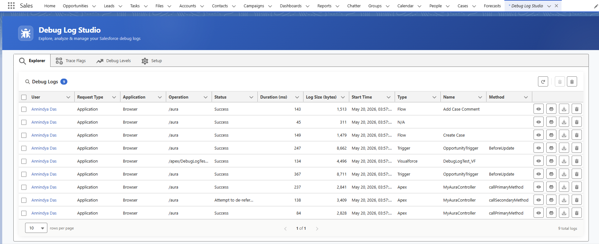
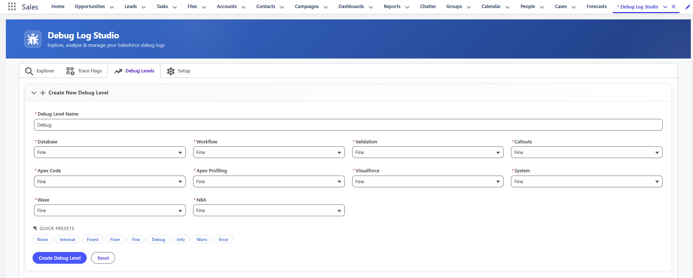
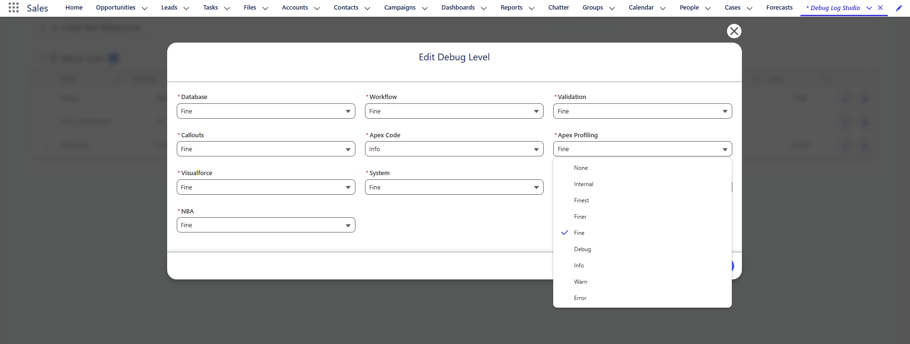
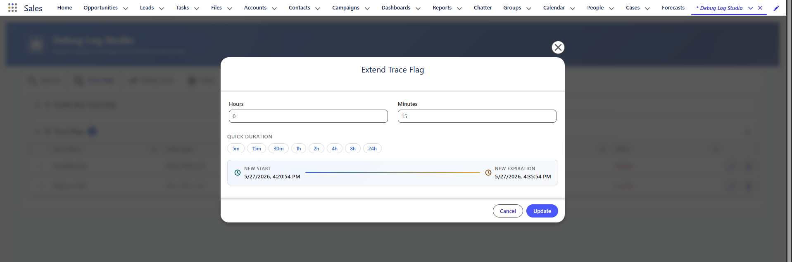
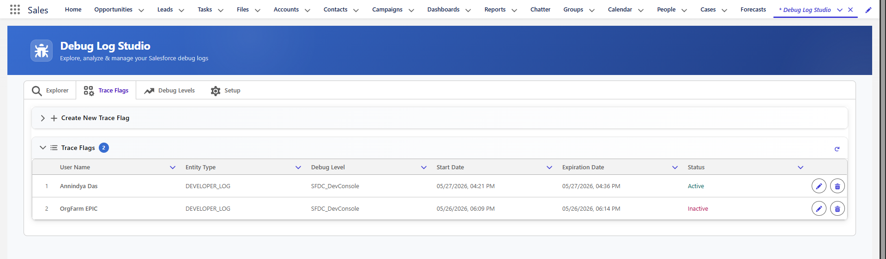
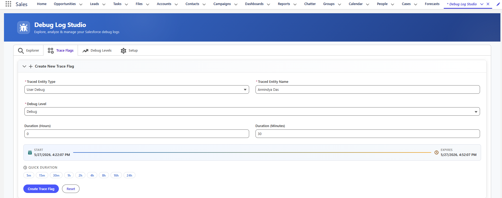
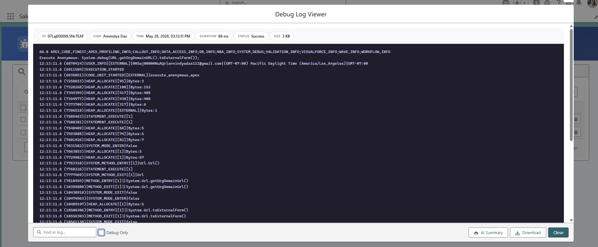
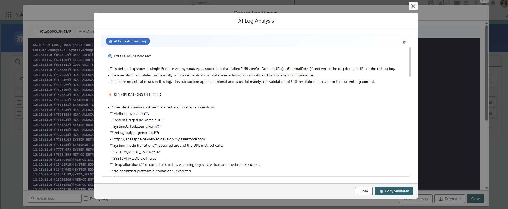

# Debug Log Studio — User Guide

> **Author:** Annindya Das | **Version:** 2026  
> **New to Debug Log Studio?** Complete the [Post-Install Setup Guide](./debug-log-studio-post-install) before using this guide.

---

## Table of Contents

1. [Overview](#1-overview)
2. [Debug Levels Tab](#2-debug-levels-tab)
3. [Trace Flags Tab](#3-trace-flags-tab)
4. [Explorer Tab](#4-explorer-tab)
5. [Log Viewer & AI Summary](#5-log-viewer--ai-summary)
6. [Need Help?](#6-need-help)

---

## 1. Overview

Once setup is complete, open **Debug Log Studio** from the App Launcher. The interface has four tabs:

| Tab | Purpose |
|-----|---------|
| **Explorer** | View, analyse, download, and delete captured debug logs |
| **Trace Flags** | Create and manage trace flags to start capturing logs for users |
| **Debug Levels** | Create and manage debug level configurations |
| **Setup** | One-time configuration wizard — see [Post-Install Guide](./debug-log-studio-post-install) |

**Recommended order of use:**
1. Create or verify a **Debug Level** → 2. Activate a **Trace Flag** → 3. Trigger activity in your org → 4. View logs in the **Explorer**

---

## 2. Debug Levels Tab

The **Debug Levels** tab lists all Debug Levels from your org, automatically loaded on open.

### Creating a New Debug Level

1. Click **"+ Create New Debug Level"** to expand the creation form.
2. Provide a **Debug Level Name**.
3. Set individual log levels for each category: Database, Workflow, Validation, Callouts, Apex Code, Apex Profiling, Visualforce, System, Wave, NBA.
4. Click **"Create Debug Level"**.

> 💡 **Tip:** Use the **Quick Presets** (None / Internal / Finest / Finer / Fine / Debug / Info / Warn / Error) to set all categories to the same level instantly.

### Editing or Deleting a Debug Level

- Click the **pencil icon** on a row → modify fields in the pop-up → click **Update**.
- Click the **delete icon** to permanently remove a Debug Level.

---

## 3. Trace Flags Tab

The **Trace Flags** tab lists all Trace Flags in your org with their status (Active/Inactive), Debug Level, and Start/Expiration times.

### Extending a Trace Flag

1. Click the **Edit** (pencil) icon on any row.
2. In the **Extend Trace Flag** pop-up, set **Hours** and **Minutes**.
3. Use **Quick Duration** presets (5m / 15m / 30m / 1h / 2h / 4h / 8h / 24h) for fast entry.
4. The updated **Start** and **Expiration** times are previewed before saving.
5. Click **Update** — the Status turns **Active** (green).

### Creating a New Trace Flag

To capture logs for a specific user or entity:

1. Click **"+ Create New Trace Flag"** to expand the form.
2. Set **Traced Entity Type**, **Traced Entity Name**, **Debug Level**, and **Duration**.
3. Use **Quick Duration** presets to set the expiration quickly.
4. Click **"Create Trace Flag"**.

---

## 4. Explorer Tab

The **Explorer** tab is the main log viewer. With an active Trace Flag in place, trigger activity in your org then head here to see the captured logs.

Each row shows enriched metadata beyond the standard Salesforce log list: **User, Request Type, Application, Operation, Status, Duration (ms), Log Size (bytes), Start Time, Type, Class Name, Method Type**.

### Available Actions

| Action | Description |
|--------|-------------|
| **View** | Opens the full log in the Debug Log Viewer pop-up |
| **Summarize** | Launches AI analysis directly without opening the viewer |
| **Download** | Saves the log as a `.txt` file |
| **Delete** | Deletes the individual log |
| **Mass Delete** | Deletes all logs in the system in one click |

---

## 5. Log Viewer & AI Summary

### Log Viewer

Click **View** on any log row to open the **Debug Log Viewer** — a dark-theme console showing the full raw log.

From the viewer you can:

- **Find in log** — search for any string within the log content
- **Debug Only** — toggle to show only `DEBUG` statements, filtering out all other noise
- **AI Summary** — launch the AI analysis pop-up
- **Download** — save the raw log as a `.txt` file
- **Close** — dismiss the viewer

### AI Summary

Click **AI Summary** (from the viewer or directly from the Explorer row) to open the **AI Log Analysis** pop-up, powered by Einstein AI.

The analysis includes:

- **AI Generated Summary** — concise overview of what the execution did
- **Issues & Warnings** — specific errors with line numbers and root cause explanation
- **Suggested Code Fix** — Apex code snippets showing exactly how to resolve each issue
- **Optimization Recommendations** — performance and best-practice suggestions

Click **Copy Summary** to copy the full analysis to your clipboard for sharing with your team.

---

## 6. Need Help?

- [Raise an issue on GitHub](https://github.com/annindyadas/appExchange-documentation/issues/new?template=debug-log-studio-issue.yml)
- Connect on [LinkedIn](https://www.linkedin.com/in/annindya-das/)
- [Post-Install Setup Guide](./debug-log-studio-post-install) — if you haven't completed setup yet

---

*Debug Log Studio — Designed and Developed by Annindya Das | Built for the Salesforce community.*
