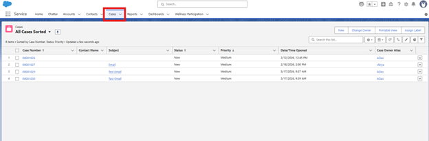
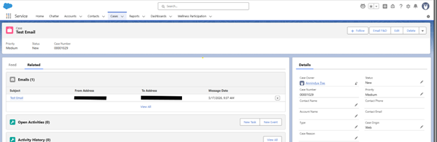
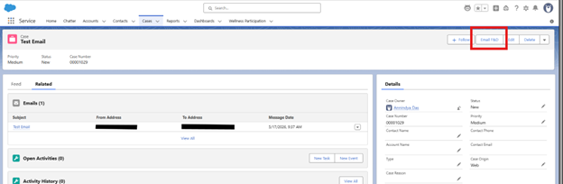
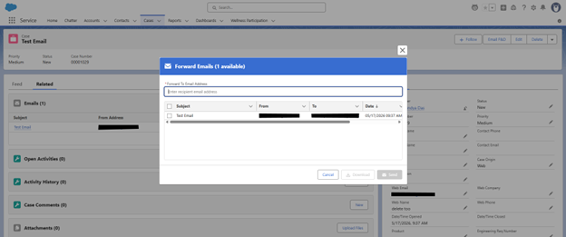
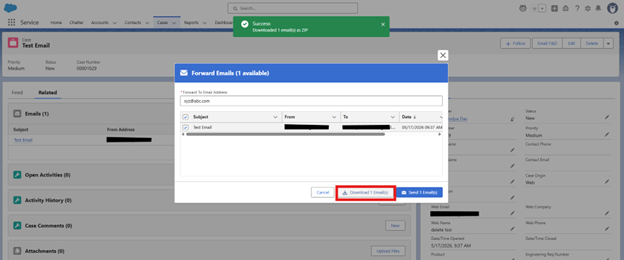
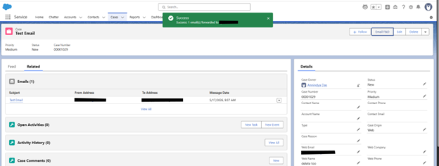
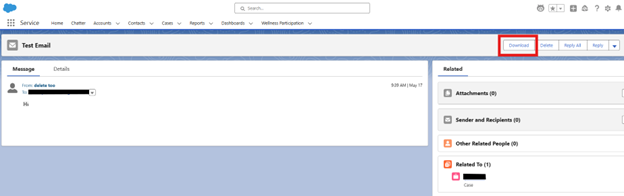

# Email F&D (Forward & Download) - User Guide

> **Prerequisite:** Post-installation steps must be completed before using this guide.  
> See the [Post-Install Setup Guide](https://annindyadas.github.io/appExchange-documentation/email-fd/post-install) if you have not done so yet.

This guide walks through the two ways to use Email F&D:
- **From a Case (or any supported record)** - forward or download one or multiple emails as `.eml` files via the Email F&D Quick Action.
- **From an individual Email Message record** - download a single email directly.

---

## Use Case 1 - Forward or Download from a Record

### Step 1: Navigate to the Cases tab

Open the **Cases** tab (or any supported object - Account, Contact, Opportunity, Lead, or a custom object with related Email Messages).

---

### Step 2: Open a Case that has Email Messages

Select a Case that has one or more Email Messages associated with it. You will see the related emails listed in the **Feed** or **Related** tab.

---

### Step 3: Click the Email F&D action

In the Case record's action bar (top right), click the **Email F&D** button.

> 💡 If you do not see the button, ask your Salesforce Administrator to add the **Email F&D** Quick Action to the page layout and assign you the correct permission set. See the [Post-Install Guide](https://annindyadas.github.io/appExchange-documentation/email-fd/post-install).

---

### Step 4: Select emails and choose Download or Forward

A modal pop-up will appear listing **all emails related to the record** (up to 1,000, sorted newest first).

From here you can:

#### Option A - Download as .eml files

1. Tick the checkbox next to the emails you want, or use the **Select All** checkbox in the header.
2. Click **Download**.
3. A ZIP file containing the selected emails as `.eml` files will be saved to your local machine.

> ✅ A green success toast - *"Downloaded N email(s) as ZIP"* - confirms the download.

#### Option B - Forward emails

1. Tick the checkbox next to the emails you want to forward.
2. Type a recipient email address in the **Forward To Email Address** field.
3. Click **Send**.
4. Salesforce sends the selected emails as `.eml` attachments to the recipient via its outbound mail service.

> ✅ A green success toast - *"Success: N email(s) forwarded to [address]"* - confirms delivery.

---

## Use Case 2 - Download from an Individual Email Message Record

### Step 5: Open the Email Message record and click Download

1. Navigate directly to an **Email Message** record (e.g. by clicking the email subject in the Case's Related list).
2. In the action bar, click **Download**.
3. The email is immediately downloaded as a single `.eml` file - no modal or further interaction required.

---

## Summary

| Action | Where | Result |
|--------|-------|--------|
| Download one or more emails | Case / Record → Email F&D button | ZIP of `.eml` files saved locally |
| Forward one or more emails | Case / Record → Email F&D button → enter recipient | Emails sent as `.eml` attachments via Salesforce |
| Download a single email | Email Message record → Download button | Single `.eml` file saved locally |

---

## Frequently Asked Questions

**Q: I don't see the Email F&D button on my record.**  
A: Ask your admin to add the Quick Action to the page layout and assign you the `Email_F_D_Full_Access` or `Email_F_D_Download_Only` permission set.

**Q: The Forward button is not visible in the modal.**  
A: You have been assigned the `Email_F_D_Download_Only` permission set. Contact your admin if you need forwarding access.

**Q: How many emails can I select at once?**  
A: The modal displays up to 1,000 emails per record. All can be selected and downloaded or forwarded in a single action.

**Q: What file format are the downloaded emails in?**  
A: Emails are downloaded as `.eml` files (RFC 822 format), bundled in a `.zip` archive. `.eml` files can be opened in most email clients including Outlook, Apple Mail, and Thunderbird.

**Q: Does forwarding create an activity or log on the record?**  
A: No. The forward action uses `setSaveAsActivity(false)`, so no Task or EmailMessage record is created as a side-effect.

---

## Need Help?

[Raise an issue](https://github.com/annindyadas/appExchange-documentation/issues/new?template=email-fd-issue.yml) on GitHub or contact us via the AppExchange listing page.

---

*Part of the [adasApps AppExchange Documentation](https://annindyadas.github.io/appExchange-documentation/) | Built for the Salesforce community.*
